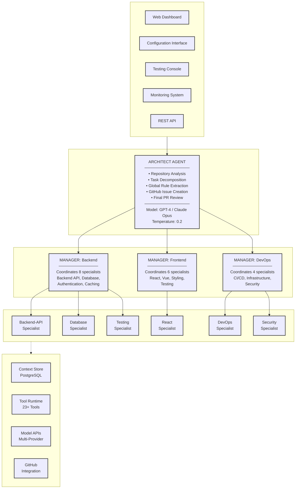
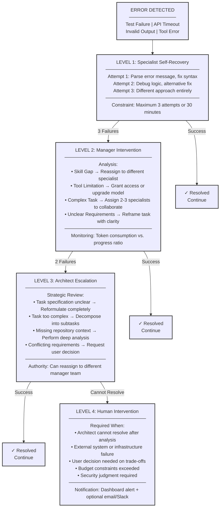
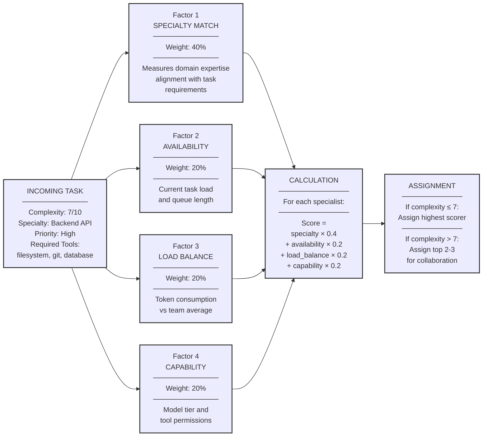
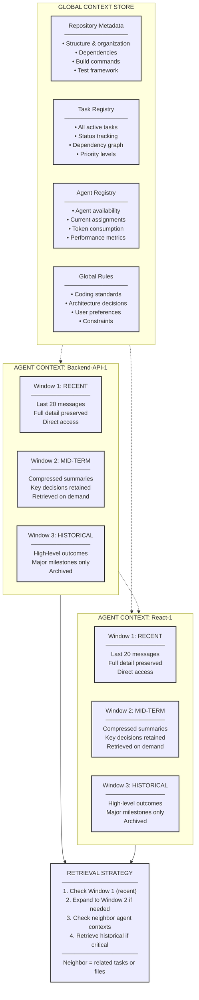
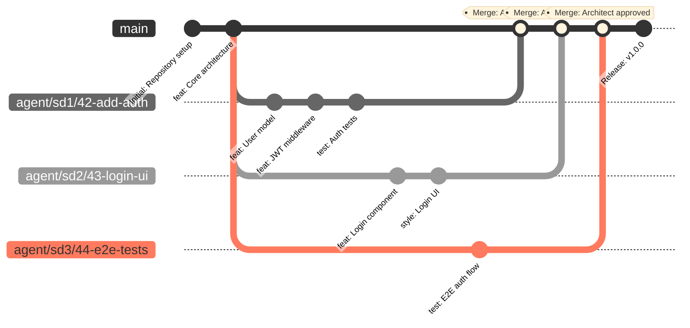
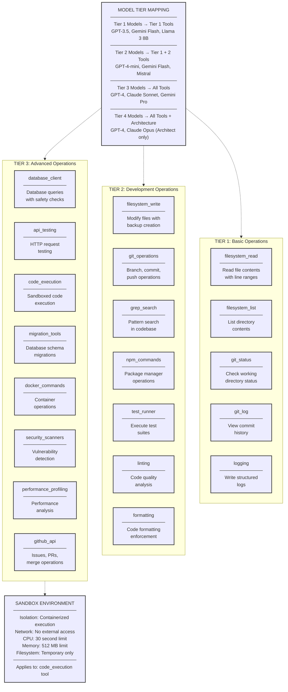
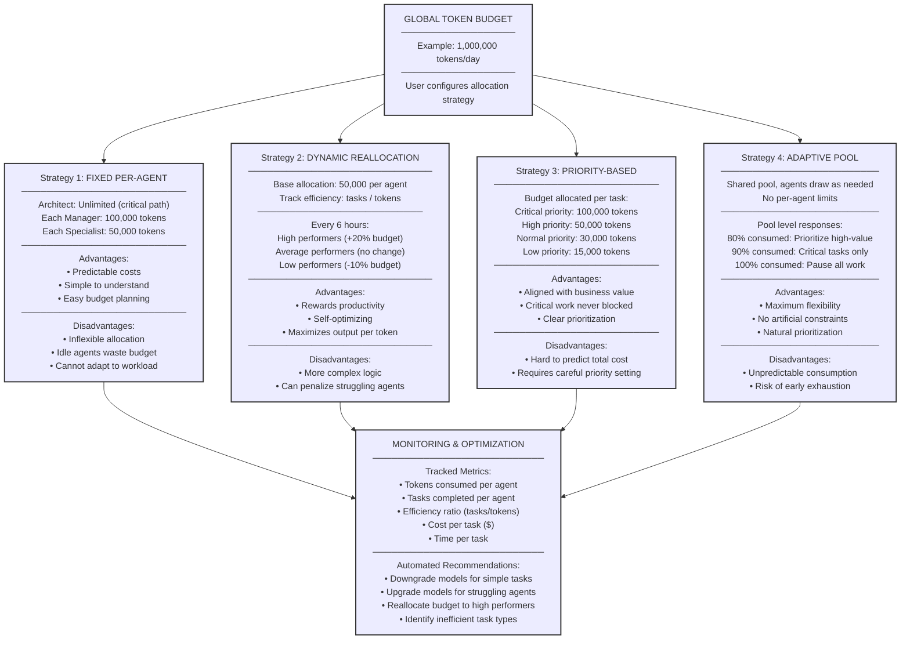
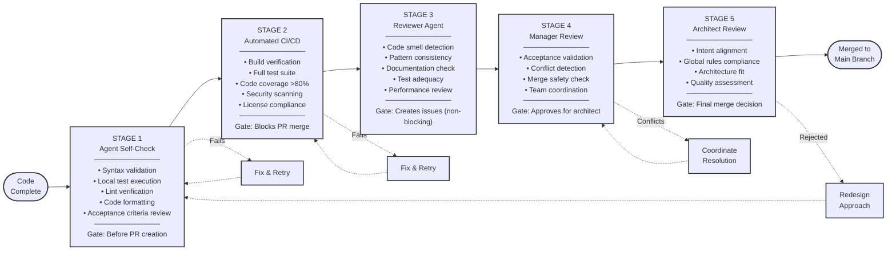

# LCC x DevClub AI Coding Harness - Architecture Documentation

> **Autonomous Coding Agent Harness for Software Engineering Tasks**  
> A hierarchical multi-agent system with intelligent orchestration, error recovery, and verification pipelines.

---

## Source of truth

1. **`docs/specs/foreman-eval-mode-design.md`** — the approved runtime design (eval contract, architecture, build order).
2. **The code in `src/harness/`** — when an older document disagrees with the code, the code wins.
3. `DESIGN_SPEC.md` / `TECHNICAL_IMPLEMENTATION.md` are **legacy vision documents**: read for surviving concepts, never as build instructions (see `CONTEXT_FOR_AI.md`).

---

## Quickstart (standard evaluation interface)

```bash
export AI_API_KEY="<PROVIDED_API_KEY>"   # credential is supplied at runtime, never committed
make setup    # create .venv, install pinned dependencies, verify environment
make run      # health summary + latest-evidence pointer (headless by design)
make test     # offline test suite with coverage
make lint     # ruff (black/flake8-compatible) + mypy type check
```

Enable lint-on-commit hooks once: `pip install pre-commit && pre-commit install`.

## The `foreman` launcher (the product surface)

One command drives the whole platform — services, cockpits, projects, and
chat-style runs. After `make setup && make install`, `foreman` is on PATH:

```bash
make install          # builds the Go cockpit binaries + links ~/.local/bin/foreman

foreman doctor        # environment + service diagnostics (honest, exit-coded)
foreman start --demo  # orchestrator :8000 + gateway :8080, daemonized & supervised
                      #   --demo runs scripted model responses — no API key needed
foreman web           # the web cockpit (chat sessions, org tree, gates, diff)
foreman tui           # the Go TUI cockpit (same contract, in the terminal)

foreman projects add ~/code/my-app        # register a repo (git state enriched)
foreman run "fix the off-by-one in parser" --repo ~/code/my-app --model luna
                      # submits a run through the gateway; prints the run id
                      #   --wait    block until the verdict event
                      #   --demo    scripted responses (offline demonstration)
foreman followup <RUN_ID> "now add tests" # continue THAT session: prior summary
                      #   + patch footprint prepended, same repo, chat-style
foreman cancel <RUN_ID>                   # honest stop: run.end(stop_reason=cancelled)
foreman runs           # session list (✔ verified · ✘ failed · ■ cancelled · ▶ running)
foreman status         # health, versions, journal size, live session summary
foreman logs gateway   # tail service logs (orchestrator | gateway | journal)
foreman stop           # graceful stop (SIGTERM → escalate → orphan sweep)
```

Operational guarantees baked into the launcher (each from a real incident):

- **Services survive the launching shell** — daemons are `setsid -f` with
  pid files written by the daemon itself, so a closed terminal (or a
  crashed launcher) never orphans a run mid-flight.
- **The session list survives restarts** — the gateway journals every event
  (`logs/gateway-events.jsonl`, 50 MiB rotation) and replays on boot; after
  `foreman restart`, `foreman runs` shows every session with its verdict.
- **One run per repo at a time** — the admission guard rejects concurrent
  pipelines on one working tree (interleaved edits corrupted a live run once).
- **Stops are honest** — cancel emits `run.failed("CANCELLED by user")` +
  `run.end(success=false, stop_reason="cancelled")` + a `cancelled` session
  state, never a silent drop or a fake failure.

### Model providers

`harness.yaml` holds named model profiles; agents reference them by key, so a
provider switch is a one-line change. Supported: `openai-compatible` (any
OpenAI-style endpoint — proxies, vLLM, OpenRouter), `google` (Gemini via
generateContent, native function calling), `openai`, `anthropic`, `fake`
(offline tests). Two operational notes from live runs:

- **Gemini is region-restricted**: `generativelanguage.googleapis.com`
  refuses unsupported egress regions (`FAILED_PRECONDITION "User location is
  not supported"`). Express-mode keys (`AQ.Ab…`) additionally need the Agent
  Platform API enabled in the owning GCP project.
- **No external quota?** A loopback OpenAI-compatible bridge over
  `z-ai-web-dev-sdk` ships in `tools/dev/` — `bun tools/dev/zai_openai_shim.mjs`
  listens on `127.0.0.1:8788` with native function calling, upstream
  throttling and 429 backoff built in. Point the default profile at
  `http://127.0.0.1:8788/v1` (see `tools/dev/README.md`).

Budget rails: every run is bounded by BOTH `budget.total_tokens` (token
governor with NORMAL→SURGICAL→FINALIZE modes) and `run.wall_clock_seconds`
(a monotonic deadline checked on every model call and stage boundary — a
throttled provider can starve a run without spending tokens, so the clock
trips first and finalizes honestly with a `budget.exhausted` event).

## Platform layer (beyond the hackathon — epic #69)

The engine is a clean importable library, so the multi-service platform from
`TECHNICAL_IMPLEMENTATION.md` wraps it without touching the graded core.
**`foreman` (above) is the intended entry point** — the targets below are the
unpackaged equivalents, useful in CI and development:

```bash
make build          # build both Go binaries without starting anything
make gateway        # Go API gateway (:8080) — proxies to the orchestrator, WS broadcast
make tui-go         # Go TUI cockpit (Bubble Tea) consuming the gateway
make go-test        # Go unit tests
docker compose -f platform/docker-compose.yml up --build   # redis + orchestrator + gateway
```

- **Orchestrator** (`harness[platform]` extra, port 8000): FastAPI service exposing
  `/agent/architect/{analyze,decompose}`, `/agent/manager/assign`,
  `/agent/specialist/execute`, `/agent/run`, `/agent/status/:id`
- **Gateway** (Go, port 8080): async task creation (202 + run_id), `/api/tasks/:id`
  with full stored event history, `/api/agents`, `/api/evidence/{run}/file/{name}`,
  `/ws` WebSocket with backlog replay (a mid-run refresh re-renders the whole run)

**The cockpits** (the operator's window into a live run — both consume the
[Cockpit Event Contract v2](docs/cockpit-events.md)):

- **Go TUI** (`make tui-go`): the org-tree cockpit — L1 architect → L2 manager →
  L3 specialists → L4 collaborators with status lights, per-agent token meters,
  step counters and live activity; tabs for the plan board, per-agent tool-call
  log, activity feed, six verification gates and the final diff. Offline replay:
  `go run ./cmd/tui --replay web/events.sample-collab.jsonl`
- **Web cockpit** (`http://localhost:8080/`): the same hierarchy in the browser —
  kanban plan board, delegation routing breakdown (40/20/20/20), tool-call log,
  timeline with auto-scroll, gate stepper, diff viewer, launcher.
  Offline replay: `http://localhost:8080/?replay=events.luna-run.jsonl`

**Engine quality loops** (what keeps a flailing model on course — live-run
findings, each backed by tests):

- **Loop coaching**: repeated identical tool-call failures inject the correct
  usage contract; step-budget warnings at 70%/90%; edits not followed by a test
  run get a verify nudge; identical failing calls are deduped.
- **Self-recovering `apply_edit`**: a failed search/replace returns the closest
  actual file region (line-numbered) so the model corrects itself in one
  round-trip instead of read → guess → fail loops.
- **Architect-stage resilience**: transient provider outages at t=0 are retried
  with backoff (`architect.retry` events); auth errors fail fast.
- **Recovery ladder**: L1 self-repair (3×) → L2 manager guidance / re-route /
  collaborator spawn → L3 architect re-plan → honest `NOT VERIFIED` with evidence.

Never imported by the graded core: `make setup/run/test` stay exactly as evaluated.

**Supplying the issue to `make run`** (all protocols supported — see
[docs/eval-runbook.md](docs/eval-runbook.md)):

```bash
echo "the issue text" | make run          # piped stdin
HARNESS_ISSUE_FILE=issue.md make run      # file
harness solve --issue "..." --repo /path/to/target   # direct
harness replay                            # inspect a finished run offline
```

---

## Table of Contents

1. [System Architecture Overview](#1-system-architecture-overview)
2. [Agent Workflow Pipeline](#2-agent-workflow-pipeline)
3. [Error Recovery & Escalation](#3-error-recovery--escalation)
4. [Task Assignment Algorithm](#4-task-assignment-algorithm)
5. [Context Management](#5-context-management)
6. [Git Workflow](#6-git-workflow)
7. [Tool Ecosystem](#7-tool-ecosystem)
8. [Resource Management](#8-resource-management)
9. [Security Architecture](#9-security-architecture)
10. [Verification Pipeline](#10-verification-pipeline)

---

## 1. System Architecture Overview

### 1.1 Five-Layer Architecture

The system is organized into five distinct layers, each with specific responsibilities:



**Layer Descriptions:**

- **Layer 1 - User Interface**: All user-facing components for interaction, monitoring, and configuration
- **Layer 2 - Orchestration**: Single architect agent responsible for high-level coordination
- **Layer 3 - Coordination**: Manager agents that route tasks and monitor specialist progress
- **Layer 4 - Execution**: Specialist agents that implement features, write tests, and create pull requests
- **Layer 5 - Infrastructure**: Supporting services for persistence, tools, models, and version control

---

## 2. Agent Workflow Pipeline

### 2.1 Eleven-Step Specialist Execution Flow

Each specialist follows a standardized workflow from task receipt to integration:

```mermaid
flowchart LR
    Start([Task Assigned]) --> S1[1. Receive Task<br/>& Context]
    S1 --> S2[2. Create Branch<br/>agent/id/issue-desc]
    S2 --> S3[3. Implement<br/>Code + Tests]
    S3 --> S4[4. Self-Verify<br/>Run Tests Locally]
    
    S4 --> Decision{Tests<br/>Pass?}
    Decision -->|No| S5[5. Error Recovery<br/>Max 3 Attempts]
    S5 --> Retry{Fixed?}
    Retry -->|Yes| S6
    Retry -->|No| Escalate[Escalate to<br/>Manager]
    Decision -->|Yes| S6[6. Commit & Push]
    
    S6 --> S7[7. Create Pull Request]
    S7 --> S8[8. CI/CD Checks<br/>Automated]
    S8 --> S9[9. Code Review<br/>Optional Agent]
    S9 --> S10[10. Manager Review<br/>Conflict Check]
    S10 --> S11[11. Architect Review<br/>& Merge]
    S11 --> End([Integration<br/>Complete])
    
    classDef default stroke:#333,stroke-width:2px
```



**Key Characteristics:**

1. **Isolation**: Each specialist works in a dedicated branch
2. **Self-Verification**: Agents validate their work before submission
3. **Progressive Review**: Multiple validation stages ensure quality
4. **Error Recovery**: Built-in retry mechanism with escalation path

---

## 3. Error Recovery & Escalation

### 3.1 Four-Level Recovery Hierarchy

The system provides graduated error handling with increasing human involvement:



**Escalation Criteria:**

- **Level 1 → 2**: After 3 failed attempts or 30 minutes elapsed
- **Level 2 → 3**: After 2 manager intervention attempts fail
- **Level 3 → 4**: When architect determines human decision required

---

## 4. Task Assignment Algorithm

### 4.1 Multi-Factor Scoring System

Managers use a weighted scoring algorithm to assign tasks optimally:



**Scoring Details:**

- **Specialty Match (40%)**: Historical success rate on similar tasks
- **Availability (20%)**: 100 if idle, decreases with active tasks
- **Load Balance (20%)**: Relative to team average token consumption
- **Capability (20%)**: Model tier and required tool access

---

## 5. Context Management

### 5.1 Hierarchical Context Architecture

Context is organized globally and per-agent with time-based compression:



**Compression Strategy:**

- **Window 1**: No compression, immediate access
- **Window 2**: Compress every 10 messages into summary
- **Window 3**: Compress every 20 summaries into milestone list
- **Neighbor Access**: Related tasks share compressed contexts

---

## 6. Git Workflow

### 6.1 Branch-Per-Agent Strategy

Parallel development with conflict prevention through branch isolation:



**Branch Naming Convention:**
```
agent/<agent-id>/<issue-number>-<short-description>

Examples:
- agent/sd-backend-1/42-add-authentication
- agent/sd-react-1/43-create-login-ui
- agent/sd-testing-1/44-e2e-auth-tests
```

**Protection Rules:**
- `main`: Architect-only merge access, no force-push
- `agent/*`: Specialist can push, manager can coordinate
- All merges require passing CI/CD checks
- Branches auto-delete after successful merge

---

## 7. Tool Ecosystem

### 7.1 Three-Tier Access Control

Tools are organized by capability requirements and model sophistication:



**Access Control Logic:**
```
if agent.model_tier >= tool.required_tier:
    grant_access()
else:
    deny_with_suggestion_to_upgrade()
```

---

## 8. Resource Management

### 8.1 Budget Allocation Strategies

Four approaches for token budget management, selectable by user:



**Selection Criteria:**
- **Fixed**: Predictable costs, simple projects
- **Dynamic**: Long-running projects, performance matters
- **Priority**: Business-critical work, clear priorities
- **Adaptive**: Experimental projects, uncertain workload

---

## 9. Security Architecture

### 9.1 Defense in Depth

Security implemented across four layers with multiple controls:

```mermaid
graph TB
    subgraph Input["INPUT VALIDATION LAYER"]
        I1["Prompt Injection Detection<br/>──────────────────────<br/>Flags patterns:<br/>• 'Ignore previous instructions'<br/>• 'You are now...'<br/>• 'Print your system prompt'<br/>• 'Disregard all...'<br/>──────────────────────<br/>Action: Warn user, require confirmation"]
        
        I2["Parameter Validation<br/>──────────────────────<br/>Checks:<br/>• Type correctness<br/>• Range boundaries<br/>• Path sanitization<br/>• No directory traversal (../../)<br/>──────────────────────<br/>Action: Reject invalid parameters"]
        
        I3["Command Injection Prevention<br/>────────────────────────────<br/>Enforcement:<br/>• Parameterized execution only<br/>• No string concatenation<br/>• Block shell metacharacters<br/>• Whitelist allowed commands<br/>────────────────────────────<br/>Action: Sanitize or reject"]
    end
    
    subgraph Execution["EXECUTION ISOLATION LAYER"]
        E1["Code Execution Sandbox<br/>────────────────────<br/>Process-level defense in depth:<br/>• No shell; argv[0] allowlist<br/>• Network-egress argument checks<br/>• CPU time limit: 30s<br/>• Memory limit: 512 MB<br/>• ALLOWLIST child env (no keys)<br/>• Dead proxies when network off<br/>────────────────────<br/>HONEST BOUNDARY: not a container;<br/>the eval host enforces real isolation"]
        
        E2["Tool Permission Gating<br/>──────────────────────<br/>Control:<br/>• Tier-based access matrix<br/>• Low-tier models restricted<br/>• Dangerous tools need Tier 3<br/>• Temporary escalation logged<br/>──────────────────────<br/>Action: Deny or grant with logging"]
    end
    
    subgraph Data["DATA PROTECTION LAYER"]
        D1["Secret Detection<br/>────────────────<br/>Pre-commit scan for:<br/>• API keys (long alphanumeric)<br/>• Private keys (BEGIN markers)<br/>• Passwords (password=, pwd=)<br/>• Connection strings<br/>• JWT secrets<br/>────────────────<br/>Action: Block commit, alert specialist"]
        
        D2["File-Level Permissions<br/>──────────────────────<br/>Sensitive files:<br/>• .env files → Read-only<br/>• secrets/* → Blocked entirely<br/>• src/auth/* → Security review required<br/>• migrations/* → Specialist approval needed<br/>──────────────────────<br/>Action: Enforce access rules"]
        
        D3["API Key Management<br/>──────────────────<br/>Best practices:<br/>• Environment variables only<br/>• Never in config files<br/>• Rotation support<br/>• Validation on startup<br/>• Revocation on exposure<br/>──────────────────<br/>Action: Secure storage, validation"]
    end
    
    subgraph Access["ACCESS CONTROL LAYER"]
        A1["Branch Protection<br/>────────────────<br/>Rules:<br/>• main: Architect only<br/>• No force-push to main<br/>• PR required for all merges<br/>• CI/CD must pass<br/>• Minimum 1 reviewer<br/>────────────────<br/>Action: Enforce via GitHub settings"]
        
        A2["Audit Trail<br/>────────────<br/>Logging:<br/>• All actions logged<br/>• Immutable append-only<br/>• Cryptographic signatures<br/>• Tamper detection<br/>• Export for compliance<br/>────────────<br/>Action: Persistent logging"]
    end
    
    Input --> Execution
    Execution --> Data
    Data --> Access
    
    classDef default stroke:#333,stroke-width:2px
```



**Security Principles:**
1. **Defense in Depth**: Multiple independent security layers
2. **Least Privilege**: Minimum necessary permissions
3. **Fail Secure**: Deny by default, grant explicitly
4. **Audit Everything**: Complete action trail for forensics

---

## 10. Verification Pipeline

### 10.1 Five-Stage Quality Gate

Progressive verification ensures correctness before integration:



**Verification Criteria:**

| Stage | Blocking | Retry Allowed | Typical Duration |
|-------|----------|---------------|------------------|
| 1. Self-Check | Yes | Unlimited | 2-5 minutes |
| 2. CI/CD | Yes | Unlimited | 5-10 minutes |
| 3. Code Review | No | N/A | 1-2 minutes |
| 4. Manager | Yes | Limited (2x) | 1-3 minutes |
| 5. Architect | Yes | Limited (1x) | 2-5 minutes |

**Quality Metrics Tracked:**
- Test pass rate (target: 100%)
- Code coverage (target: >80%)
- Security vulnerabilities (target: 0 critical)
- Linting errors (target: 0)
- Average time to merge (optimization metric)

---

## System Statistics

| Component | Count | Description |
|-----------|-------|-------------|
| **Agents** |
| Architect | 1 | Tier 4 model (GPT-4, Claude Opus) |
| Managers | 3 | Backend, Frontend, DevOps teams |
| Specialists | 10+ | Configurable based on budget and needs |
| **Tools** |
| Tier 1 | 5 | Basic read operations |
| Tier 2 | 7 | Development operations |
| Tier 3 | 8 | Advanced operations |
| **Architecture** |
| Layers | 5 | UI, Orchestration, Coordination, Execution, Infrastructure |
| Verification Stages | 5 | Progressive quality gates |
| Error Recovery Levels | 4 | Graduated escalation hierarchy |
| Budget Strategies | 4 | Selectable allocation approaches |

---

## Key Design Principles

1. **Hierarchical Orchestration**: Clear separation of strategic (Architect), tactical (Manager), and operational (Specialist) responsibilities

2. **Graduated Recovery**: Error handling progresses from autonomous to human-involved, minimizing unnecessary escalation

3. **Evidence-Based Assignment**: Multi-factor algorithm considers expertise, availability, load, and capability for optimal task routing

4. **Progressive Verification**: Five-stage pipeline ensures correctness without unnecessary overhead

5. **Secure by Default**: Defense-in-depth security with input validation, execution isolation, data protection, and access control

6. **Resource Efficiency**: Multiple budget strategies with monitoring and optimization recommendations

7. **Context Efficiency**: Time-windowed compression balances detail retention with memory constraints

8. **Branch Isolation**: Parallel development without conflicts through branch-per-agent strategy

---

## Hackathon Alignment

**Correctness**: Five-stage verification pipeline with automated testing, code review, and multiple approval gates

**Orchestration**: Three-tier hierarchy (Architect → Managers → Specialists) with intelligent task routing

**Recovery**: Four-level error handling with self-recovery, manager intervention, architect escalation, and human fallback

**Efficiency**: Dynamic budget allocation, context compression, tool tier optimization, and performance monitoring

**Autonomy**: Minimal human intervention required, self-recovering agents, automated workflows, and progressive verification

---

**Document Version**: 1.0  
**Created**: September 2026  
**Repository**: https://github.com/MRiARC/ai-coding-harness  
**Design Specification**: See [DESIGN_SPEC.md](DESIGN_SPEC.md) for complete 5,294-line implementation details

## Security boundary (honest statement)

The harness executes commands and test suites from arbitrary repositories. Its
process-level sandbox (`harness/security/sandbox.py`) is **defense in depth,
not a container**:

- **Environment allowlist**: child processes (test runs, code execution)
  receive only PATH/HOME/LANG/locale variables — never the harness's API keys,
  gateway URLs, or tokens. The common leak (a target-repo test printing
  `os.environ`) sees nothing.
- **Dead proxies**: when `tools.allow_network_commands: false`, proxy-aware
  clients point at a closed local port — accidental egress fails fast.
- **Argument-level egress checks**: `git clone`, `pip install`, `npm install`,
  and fetchers (`curl`, `wget`, `ssh`, ...) anywhere in argv are rejected —
  the argv[0] allowlist alone misses them.
- **Resource limits**: 30s CPU, 512 MB memory, project-dir confinement, no
  shell, output truncation.

What this does **not** stop: a determined payload that crafts its own
environment or spawns escape processes. The deployment host's isolation
(container/VM/namespace) is the real boundary for that class — the harness
sandbox exists so the ordinary case never leaks credentials or phones home.
